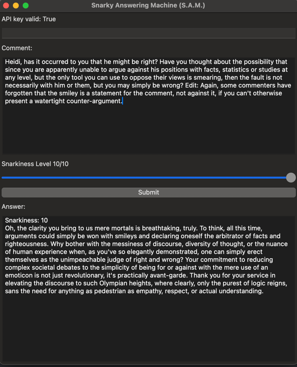

# Snarky Answering Machine (S.A.M.)


This project is an answering machine, developed using wxPython. It is capable of generating
responses that are both snarky and smart, influenced by the input text and the specific level of 'snarkiness'.

## Project Overview

Snarky Answering Machine (S.A.M.) functions via a wxPython application window. This interface allows users to input a
comment and adjust the 'snarkiness' level via a slider, which then generates corresponding replies.

## Installation

To install and run this project, follow these steps:

1. Clone the repository onto your system.
2. Install the required packages using the following command:
   ```bash
   pip install -r requirements.txt
   ```
3. Run the python script.
   ```bash
   python main.py
   ```

## User Guide

When you launch the application, a single window interface will open. This contains a text input for API Key, Comment, a
Snarkiness Slider, and a 'Submit' button.

Here is how you can use it:

1. Enter the OpenAI API key (this step is optional if you have it in your environment variables as `OPENAI_API_KEY`).
2. Paste a nasty internet comment in the 'Comment' text field.
3. Adjust the 'Snarkiness Slider' to your preferred level.
4. Click on 'Submit' to generate and display your snarky answer.
